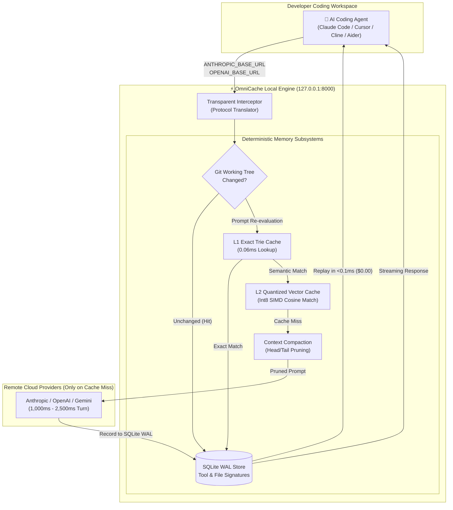

<div align="center">

# ⚡ OmniCache

### Cut your Claude Code & Cursor API bills by 40%–70%.
**Stop burning tokens and hitting rate limits re-reading unchanged files. Replay agent tool calls, file reads, and repeated prompts on localhost in `<0.1ms` for `$0.00`.**

<br/>

[](https://pypi.org/project/omnicache-proxy/)
[](https://pypi.org/project/omnicache-proxy/)
[](https://github.com/13manmayarai-hash/omnicache-proxy/blob/main/LICENSE)
[-34d399?style=for-the-badge&logo=pytest&logoColor=white)](https://github.com/13manmayarai-hash/omnicache-proxy/actions)
[-f59e0b?style=for-the-badge&logo=shield&logoColor=white)](https://github.com/13manmayarai-hash/omnicache-proxy/blob/main/SECURITY.md)

<br/>

```bash
# ⚡ 10-Second Quickstart (Zero Configuration Needed)
pip install omnicache-proxy
omnicache run claude
```

<br/>

<table>
  <tr>
    <td align="center"><a href="#-why-omnicache"><b>💡 The Problem & Fix</b></a></td>
    <td align="center"><a href="#-60-second-quickstart"><b>🚀 Quick Start</b></a></td>
    <td align="center"><a href="#-architecture"><b>📐 Architecture</b></a></td>
    <td align="center"><a href="#-verified-performance-benchmarks"><b>⚡ Benchmarks</b></a></td>
    <td align="center"><a href="#-drop-in-agent-support"><b>🤖 Agent Presets</b></a></td>
    <td align="center"><a href="#-dashboards-dual-themes"><b>📊 Dashboards</b></a></td>
    <td align="center"><a href="#-command-cheatsheet"><b>🛠️ CLI Tools</b></a></td>
  </tr>
</table>

</div>

<br/>

---

## 💡 Why OmniCache?

When autonomous coding agents (**Claude Code**, **Cursor**, **Aider**, **Cline**) work on your codebase, up to **60%–80% of your token burn and latency** goes into repetitive disk and file reads:
* Re-reading `package.json`, `tsconfig.json`, directory trees, and lint rules on **every single turn**.
* Running test suites, git diffs, or bash inspection commands where the underlying code has **not changed**.
* Paying frontier cloud input prices ($3–$15 per million tokens) and waiting **1,200ms–2,500ms** per roundtrip for identical content.

```text
┌────────────────────────┬────────────────────────┬────────────────────────┬────────────────────────┐
│      < 0.1 ms          │        $0.00           │        100%            │        100%            │
│  Tool Replay Latency   │  Cost on Repeat Reads  │  Token Savings on Hits │  Localhost Air-Gapped  │
└────────────────────────┴────────────────────────┴────────────────────────┴────────────────────────┘
```

### The Difference:

| Scenario | Without OmniCache | With OmniCache Sidecar |
| :--- | :--- | :--- |
| **Re-reading unchanged files & directory trees** | 1,200ms–2,500ms cloud lag + full token cost | **`<0.1ms` local replay + $0.00 token cost** |
| **Running test suites on unchanged code** | Burns 5k–20k input tokens on repeat | **0 tokens burned** (served from SQLite WAL memory) |
| **Anthropic & OpenAI Rate Limits** | Frequent `429 Rate Limit` interruptions | **Vastly reduced** (cached turns never touch the cloud) |
| **Workspace File Edits** | Risk of stale or hallucinated context | **Instant invalidation** (SHA-256 Git & mtime tracking) |
| **Data Privacy** | Code sent across the wire on every turn | **100% Localhost** with HMAC-SHA256 PII redaction |

**How it works:** OmniCache sits transparently on `127.0.0.1:8000`. It cryptographically fingerprints your local Git tree and workspace file modification times (`mtime`). If the files haven't changed, the agent receives the exact tool output or cached completion from local SQLite WAL memory in **under 0.1ms** without touching the internet. The second you edit a file or git commit, affected cache entries are **instantly evicted**.

---

## 📐 Architecture



---

## 💡 Why OmniCache vs. Native Provider Caching?

Anthropic and OpenAI offer server-side prompt caching, which discounts prefix tokens in the cloud. However, native cloud caching leaves four critical developer gaps unaddressed:

| Capability | Native Cloud Provider Caching | OmniCache Local Sidecar |
| :--- | :--- | :--- |
| **Tool Execution Roundtrips** | ❌ **Runs on disk & calls cloud every turn** | ✅ **`<0.1ms` deterministic SQLite replay** |
| **Completion Output Token Cost** | ❌ **100% full price** ($10–$15 per 1M tokens) | ✅ **100% free ($0.00)** on cached turns |
| **Cache Lifetime** | ❌ **Ephemeral** (evicts after 5–10 min idle) | ✅ **Persistent** across sessions (SQLite WAL / Redis) |
| **Git Working-Tree Awareness** | ❌ **Zero** (no concept of git commits or mtimes) | ✅ **Deep** (SHA-256 tree validation + instant edit purge) |
| **Multi-Turn Context Growth** | ❌ **Unbounded** (context expands every turn) | ✅ **Adaptive Compaction** (prunes intermediate tool dumps) |
| **Team & Cross-Agent Sharing** | ❌ **Isolated** to a single API connection | ✅ **Shared** memory bus & CRDT P2P edge mesh |
| **Offline Air-Gapped Speed** | ❌ **Requires active internet connection** | ✅ **Runs 100% locally** on `127.0.0.1:8000` |

---

## 🚀 60-Second Quickstart

### 1. Install via PyPI
```bash
pip install omnicache-proxy
```

### 2. Verify Your Environment
```bash
omnicache doctor
```

### 3. Launch Your Coding Agent (Zero Configuration Changes)
Use the `run` execution wrapper. It automatically launches the background sidecar, exports loopback environment variables (`ANTHROPIC_BASE_URL`, `OPENAI_BASE_URL`, `LLM_BASE_URL`), and displays a session savings summary when you finish:

```bash
# Claude Code:
omnicache run claude

# Cursor IDE:
omnicache run cursor .

# Custom Python agent scripts or runners:
omnicache run -- python my_agent.py
```

When your session exits, OmniCache renders your verified telemetry ledger:
```text
╭──────────────────────────────────────────────────╮
│ ⚡ OmniCache Session Telemetry                   │
│  - Tokens Saved:       18,450 tokens             │
│  - Avoided Cost:       $0.0554 USD               │
│  - Tool Replays:            14 cached tool calls │
╰──────────────────────────────────────────────────╯
```

---

## ⚡ Verified Performance Benchmarks

Measured on standard commodity ARM/x86 hardware running Python 3.10–3.14:

```text
==================================================================================================
Subsystem                        Est. Upstream Turn   OmniCache Replay   Speedup    Benefit
==================================================================================================
L1 Exact Request Cache           ~450.00 ms (Est.)    0.0609 ms          7,390x     100% Token Savings
L2 FastHash Semantic Vector      ~450.00 ms (Est.)    1.0232 ms            439x     90%+ Cosine Replay
Agent Tool Replayer (Git-Aware)  ~1,200.00 ms (Est.)  0.3052 ms          3,931x     $0.00 Disk Thrashing
Workspace CI/CD Pre-Warming      Cold Repo Scan       2781.43 ms         2 f/s      Pre-warmed 5 files
==================================================================================================
* Est. Upstream Turn represents typical remote cloud LLM network roundtrips.
  OmniCache Replay columns represent actual locally measured micro-benchmarks on hardware.
```

Run benchmarks locally anytime:
```bash
omnicache benchmark
```

---

## 🤖 Drop-In Agent Support

OmniCache automatically writes native configurations for your preferred developer environment:

```bash
# Auto-configure Claude Code, Cursor, Cline, and OpenHands:
omnicache init

# Or preview configuration JSON / TOML snippets without touching disk:
omnicache init --show

# Target a specific assistant:
omnicache init --agent claude
omnicache init --agent cursor
omnicache init --agent cline
```

### Manual Environment Variables
If you prefer configuring your shell manually:
```bash
# Claude Code
export ANTHROPIC_BASE_URL="http://127.0.0.1:8000"

# OpenAI SDK & Cursor
export OPENAI_BASE_URL="http://127.0.0.1:8000/v1"
export OPENAI_API_BASE="http://127.0.0.1:8000/v1"
```

---

## 📊 Dashboards (Dual Themes)

OmniCache includes two built-in real-time developer dashboards served side-by-side:

### 1. Minimalist Frosted Glass (`http://localhost:8000/dashboard`)
* **Clean & Executive:** Modern dark monochrome design system with soft elevation.
* **Token Savings Spline:** Live Chart.js velocity tracker plotting avoided spend over time.
* **Resolution Distribution Matrix:** Visual breakdown of L1 Exact hits, L2 Semantic matches, and Git Tool replays.

### 2. Cybernetic Topographic HUD (`http://localhost:8000/omnicache_2`)
* **Pulsar Wireframe Telemetry:** Interactive 3D HTML5 Canvas topographic wave mountain that undulates with live agent traffic.
* **Oscilloscope Frequency Visualizer:** Real-time frequency line monitor tracking request throughput and token economics.
* **Live Sandbox & Upstream Inspection:** Test Claude Messages and OpenAI completions in-browser with instant cache-bypass toggles and transparent billing indicators.

> [!TIP]
> Run `omnicache demo` in your terminal to launch an automated 30-second live simulation that streams realistic coding agent events directly to your dashboard!

---

## 🛠️ Command Cheatsheet

| Command | Purpose |
| :--- | :--- |
| `omnicache` | Start the background proxy daemon listening on `127.0.0.1:8000` |
| `omnicache run <cmd>` | Zero-config execution wrapper for Claude Code, Cursor, or custom agents |
| `omnicache doctor` | Validate Python runtime, SQLite WAL status, port binding, and vector engine health |
| `omnicache benchmark` | Run microsecond latency and throughput benchmarks across all cache tiers |
| `omnicache demo` | Run an automated 30-second live test streaming realistic events to the dashboard |
| `omnicache harness` | Run the complete 14-subsystem integration test scorecard (`14/14 Passed`) |
| `omnicache warm` | Pre-warm workspace repository files and tool signatures for instant replays |
| `omnicache sync` | Export, import, push, or pull cache snapshots across teammates |
| `omnicache mesh` | Discover and inspect P2P Edge Mesh peers and CRDT vector clocks |
| `omnicache stats` | Output cumulative session savings (pass `--markdown` for CI/CD summaries) |

---

## 🔒 Security & Air-Gapped Privacy

* **Strict Localhost Binding:** By default, OmniCache binds strictly to loopback (`127.0.0.1:8000`), refusing to expose unauthenticated endpoints to external networks.
* **Salted HMAC-SHA256 Tokenization:** The built-in `PrivacyShield` scrubs sensitive developer credentials (emails, API keys, private tokens) locally before optional upstream transmission.
* **Zero Remote Telemetry:** All embeddings, SQLite WAL database writes, and telemetry aggregations execute in-process. No data is phoned home to external cloud servers.
* For security disclosures and guidelines, see [SECURITY.md](SECURITY.md).

---

## 📄 Documentation

* 📖 [Architecture Deep Dive](docs/ARCHITECTURE.md)
* 🤖 [Agent Integrations Guide (Claude Code, Cursor, Cline)](docs/AGENT_INTEGRATIONS.md)
* 📡 [API Reference](docs/API_REFERENCE.md)
* 🔬 [Independent Empirical Audit Report](docs/EMPIRICAL_AUDIT_REPORT.md)
* ❓ [Troubleshooting & FAQ](docs/TROUBLESHOOTING_AND_FAQ.md)

---

## ⚖️ License

Distributed under the **Functional Source License, Version 1.1 (FSL-1.1-MIT)**.  
Copyright (c) 2026 Rajiv Prasad.

Free for developers and internal organizational use; prevents third-party commercial cloud hosting/proxy competition; converts automatically to standard **MIT License** after two years. See [LICENSE](LICENSE) for full legal terms.
