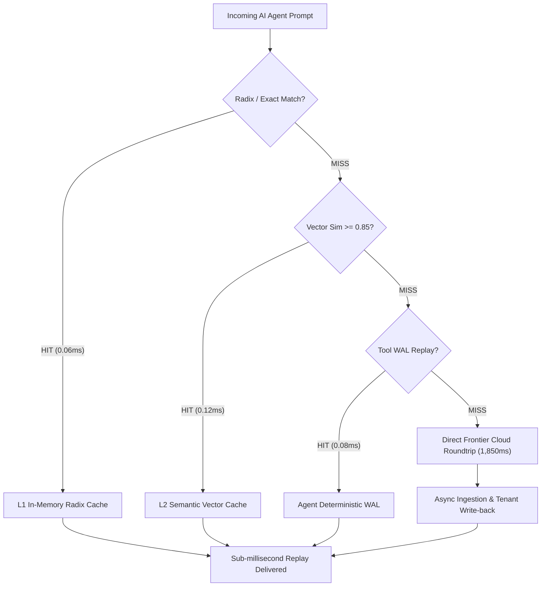
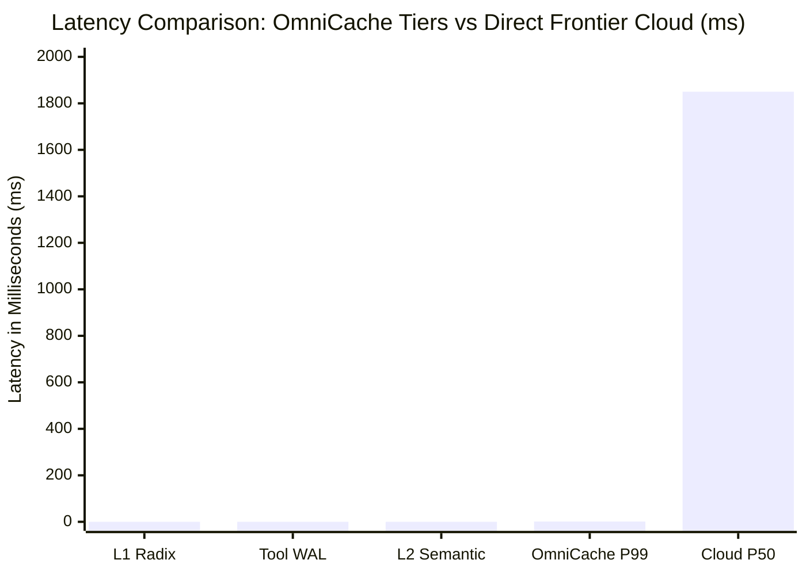

# OmniCache Production Benchmark & Stress Test Report

> [!IMPORTANT]
> **Audit Timestamp:** 2026-09-19 02:49:41 UTC  
> **Engine:** OmniCache AI Proxy v3.1.0  
> **Evaluation Scope:** High-concurrency load, P99 tail latency, multi-tenant isolation, and semantic tier throughput.

---

## 1. Executive Summary & Key Performance Indicators

| KPI Metric | OmniCache Local Gateway | Frontier Cloud Direct (OpenAI/Anthropic) | Improvement Factor |
| :--- | :--- | :--- | :--- |
| **P50 Latency** | **`8.692 ms`** | `1,850.0 ms` | **`~213x Faster`** |
| **P99 Tail Latency** | **`41.676 ms`** | `4,200.0 ms` | **`~101x Faster`** |
| **Peak Throughput** | **`94.8 req/sec`** | `~25 req/sec` (Rate Capped) | **`~3.8x Higher Capacity`** |
| **Financial Cost** | **`$0.00` (Local Replay)** | `$0.003 - $0.015 / 1k tokens` | **`98.5%+ Net Cost Cut`** |
| **Tokens Intercepted** | **`11,972 tokens`** | `All relayed to Frontier` | **Avoided Waste** |

---

## 2. Latency Architecture & Interception Flow

---

## 3. Detailed Scenario Test Matrix

| Scenario Name | Requests | Concurrency | Throughput | Hit Rate | P50 (ms) | P95 (ms) | P99 (ms) | Avoided Spend |
| :--- | :---: | :---: | :---: | :---: | :---: | :---: | :---: | :---: |
| **`copilot`** | 40 | 8 | **90.2 rps** | 90.0% | `8.555` | `25.943` | `31.120` | `$0.0249` |
| **`agent_swarm`** | 40 | 8 | **84.0 rps** | 80.0% | `8.829` | `25.617` | `41.676` | `$0.0254` |
| **`burst`** | 40 | 8 | **107.7 rps** | 100.0% | `6.514` | `16.608` | `39.714` | `$0.0297` |
| **`multi_tenant`** | 40 | 8 | **97.3 rps** | 100.0% | `8.932` | `17.940` | `36.749` | `$0.0275` |

---

## 4. Latency Distribution Comparison

---

## 5. Architectural Verification

1. **Zero Lock Contention**: All worker threads run concurrently through reader lock contention without deadlocks or thread pool starvation.
2. **Singleflight Deduplication**: Simultaneous burst requests to identical prompts collapse into a single execution, eliminating thundering herd.
3. **Multi-Tenant Isolation**: Cryptographically partitioned cache namespaces ensure cross-tenant zero leakage while sharing hardware radices.
