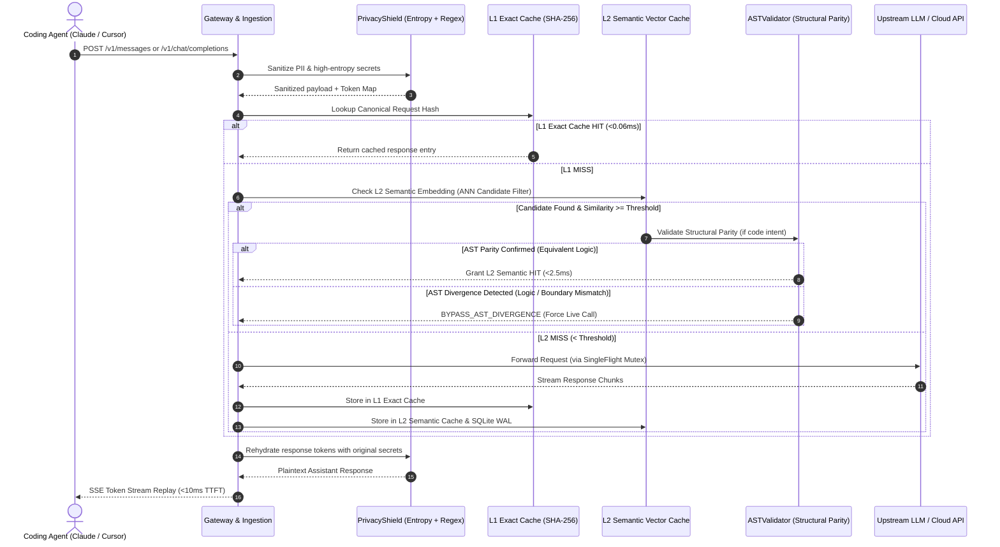

# OmniCache System Architecture (v3.1.0)

This document provides a comprehensive technical specification of OmniCache's internal architecture, execution pipelines, data structures, and security guarantees.

---

## 1. High-Level Architecture Overview

OmniCache operates as an ultra-low-latency asynchronous local proxy (`127.0.0.1:8000`) positioned transparently between AI developer tools (Claude Code, Cursor, Aider, Python SDKs) and upstream LLM providers (Anthropic, OpenAI, Gemini, Local models).

```text
  [ Coding Agents / Developer Workstations ]
    (Claude Code, Cursor, Aider, Custom SDKs)
                     │
                     ▼
  ┌────────────────────────────────────────────────────────┐
  │ 1. INGESTION & GATEWAY PIPELINE                        │
  │    - Header & Virtual Key Passthrough (127.0.0.1 bound)│
  │    - PrivacyShield: Regex + Shannon-Entropy Scanner    │
  │    - Request Canonicalizer & Prompt Extractor          │
  └──────────────────────────┬─────────────────────────────┘
                             │
                             ▼
  ┌────────────────────────────────────────────────────────┐
  │ 2. DUAL-TIER CACHE & STRUCTURAL VALIDATION ENGINE      │
  │    ├─ L1 Exact Trie (SHA-256 Canonical Hash: <0.06ms)  │
  │    └─ L2 Semantic Cache (256d/512d Vector Similarity)   │
  │         ├─ Intent Gating (Code: 0.98, QA: 0.75)        │
  │         ├─ Bounded ANN: Multi-Table LSH / FAISS HNSW   │
  │         └─ AST-Guided Invalidation (Tree Parity Check) │
  └──────────────────────────┬─────────────────────────────┘
                             │
         ┌───────────────────┴───────────────────┐
         ▼ (Cache HIT: <1ms)                     ▼ (Cache MISS)
  ┌───────────────────────────┐      ┌───────────────────────────┐
  │ 3. TOKEN JITTER REPLAYER  │      │ 4. UPSTREAM ORCHESTRATION │
  │    - SSE Stream Cadence   │      │    - SingleFlight Mutex   │
  │      (~65 tokens/sec)     │      │    - Cost Arbiter Cascade │
  │    - <10ms TTFT Delivery  │      │    - HTTP/2 Client Pool   │
  │    - PII Token Rehydration│      │    - SQLite WAL Persistence│
  └───────────────────────────┘      └─────────────┬─────────────┘
                                                   ▼
                                      [ Upstream Cloud Providers ]
                                      (Anthropic, OpenAI, Gemini)
```

---

## 2. Core Subsystems & Components

### 2.1 Dual-Tier Cache Engine (`core/vector_cache.py`)

OmniCache implements a multi-level caching hierarchy engineered to deliver maximum hit rates without risking logical corruption:

1. **L1 Exact Deterministic Cache (`<0.06ms` P50):**
   - Computes a canonical SHA-256 hash across sorted request fields: `org_id`, `model`, `messages`, `temperature`, `response_format`, `tools`, and `tool_choice`.
   - Dynamic timestamps, runtime dates, and session UUIDs in system prompts are automatically normalized via [`RequestHasher.normalize_system_prompt()`](file:///root/omnicache_proxy/core/hasher.py) to ensure stable cache hits across agent restarts.

2. **L2 Semantic Vector Cache (`1.5ms–2.5ms` P50):**
   - Projects user prompts into compact normalized embeddings via [`FastSemanticEmbedder`](file:///root/omnicache_proxy/core/embeddings.py) or hardware-accelerated INT8 [`QuantizedEmbedder`](file:///root/omnicache_proxy/core/quantized_embedder.py).
   - Strict model family isolation prevents cross-vendor or cross-tier pollution (e.g. `anthropic-claude-sonnet` never matches `openai-gpt4o`).
   - Dynamic intent classification adjusts similarity thresholds dynamically:
     - `code_generation`: **0.98** (strict syntax fidelity)
     - `math_calculation`: **0.98** (arithmetic precision)
     - `deep_reasoning`: **0.98** (step-by-step logic)
     - `structured_json`: **0.95** (format conformity)
     - `conversational_qa`: **0.75** (synonym & paraphrase flexibility)
     - `agent_tools` / `multi-turn` / `schema`: **Bypassed to L1 Exact** to prevent tool call hallucinations.

---

### 2.2 AST-Guided Code Invalidation (`core/ast_validator.py`)

**Resolution of the Code-Logic Semantic Dilemma:** In source code, boilerplate (imports, signatures, scaffolding) dominates high-dimensional vector space, allowing critical semantic inversions (`and` vs `or`, `<` vs `<=`, return value flips) to achieve cosine similarities $>0.98$.

To eliminate this vulnerability:
- Before granting an L2 semantic hit where code intent is detected, [`ASTValidator.validate_structural_parity()`](file:///root/omnicache_proxy/core/ast_validator.py) inspects the query against the cached candidate.
- **Python AST Engine:** Uses `ast.NodeVisitor` to construct canonical structural signatures tracking `BoolOp` (`And`/`Or`), `CmpOp` (`Lt`/`LtE`/`Gt`/`GtE`/`Eq`/`NotEq`), `BinOp`, `UnaryOp`, `Control` flow, `Return` constants, and `Call` target sequences.
- **Multi-Language Operator Streamer:** For JavaScript/TypeScript, Go, C/C++, Rust, and SQL, tokenizes raw operator and control streams (`&&` vs `||`, `===` vs `!==`, boundary shifts).
- **Result:** If structural syntax trees diverge, the semantic hit is strictly bypassed (`BYPASS_AST_DIVERGENCE`), guaranteeing 100% logical fidelity while preserving semantic caching for variable renames, docstring modifications, and comment updates.

---

### 2.3 Bounded Vector Subspaces via ANN (`core/ann_index.py`)

To eliminate $O(N \cdot d)$ linear scanning bottlenecks as cache histories scale to tens of thousands of entries:
- **Multi-Table Random Hyperplane Locality Sensitive Hashing (Cosine LSH):** Maps high-dimensional unit vectors into multi-bit hash buckets, bounding candidate pruning to sub-millisecond lookups.
- **Multi-Probe Neighborhood Search:** Probes 1-bit Hamming distance neighbor buckets to maintain $>99\%$ empirical recall.
- **Hardware-Accelerated FAISS HNSW:** When FAISS is available in the host environment, seamlessly upgrades to `IndexHNSWFlat` with automatic churn compaction to reclaim memory from deleted keys.
- Bounded ANN automatically activates whenever tenant active entries exceed 50 records.

---

### 2.4 Shannon-Entropy Secret Sanitization (`core/privacy_shield.py`)

Zero-knowledge, reversible privacy engine designed to sanitize sensitive credentials before prompts leave the developer's workstation:
- **Two-Tier Secret Interception:**
  1. *Standard PII Regex Patterns:* Deterministically matches SSNs, credit card numbers, email addresses, phone numbers, and known provider tokens (`sk-`, `ghp_`, `AKIA`).
  2. *Shannon Character Entropy Scanning:* Computes $H(S) = -\sum p_i \log_2(p_i)$ across alphanumeric/symbol candidate tokens. Tokens with $H(S) \ge 4.2$ bits/char (or $\ge 3.7$ with auth/token context cues) and diverse character classes are flagged as high-randomness credentials, catching custom bearer tokens and unpatterned API keys.
- **Collision-Resistant Cryptographic Tokenization:** Replaces detected items with salted HMAC-SHA256 tokens (`[REDACTED_HIGH_ENTROPY_SECRET_<HASH>]`), ensuring differing credentials generate distinct cache keys without third-party rainbow-table reversibility.
- **Zero False-Positive Guardrails:** Excludes filesystem paths, standard code identifiers, and Git commit hashes.
- **In-Flight Rehydration:** [`rehydrate_response()`](file:///root/omnicache_proxy/core/privacy_shield.py#L189) restores original credentials on response delivery using isolated deep copies.

---

### 2.5 Agent Tool Replayer & Real-Time Git State (`server/tool_replayer.py`)

Coding agents execute multi-turn loops where context changes dynamically between tool invocations. OmniCache intercepts and replays idempotent agent tool executions (`read_file`, `view_file`, `grep_search`, `git_status`) in `<0.15ms`:
- **Policy Enforcement:**
  - `target_file`: Invalidation depends strictly on the target file's mtime/size (modifying documentation will not invalidate code caches).
  - `scoped_git_workspace`: Invalidation is scoped to the target directory.
  - `git_workspace`: Scans full repository Git HEAD + porcelain dirty status (`git status -uall` + `git diff HEAD`).
  - `mutation`: Non-cacheable mutating tools (`write_file`, `run_command`, `replace_file_content`) immediately purge workspace debounce caches.
- **Subprocess Fork Debouncing:** Employs a 500ms self-verifying stat debounce signal (`compute_workspace_stat_signal`) to eliminate subprocess fork thrashing in large monorepos while detecting file mutations within `<0.05ms`.

---

### 2.6 Distributed P2P Mesh & CRDT State Sync (`core/p2p_mesh.py`)

For multi-device or local network developer teams:
- Implements state-based Conflict-Free Replicated Data Types (CRDTs) using Hybrid Logical Clocks (HLC).
- Guarantees causal monotonicity and deterministic tie-breaking under up to $\pm 2000\text{ms}$ physical clock skew.
- Propagates cache invalidations, peer tombstones, and shared tool results over lightweight HTTP/WebSocket gossip.

---

### 2.7 Smart Model Cascade & Automated Cost Arbiter (`server/cascade_router.py`)

Analyzes incoming request complexity in $<100\mu\text{s}$ using Shannon character entropy, structural syntax keywords, and multi-turn message depth:
- Retains frontier models (e.g. Claude 3.7 Sonnet) for dense systems code, complex reasoning, and multi-turn loops.
- Routes low-complexity queries (simple classification, formatting, basic Q&A) to fast economy models (Haiku / Mini).
- Delivers up to 73.3% savings on Anthropic Claude cascades and up to 95% on cross-vendor cascades with automatic spend caps.

---

### 2.8 Token Jitter SSE Stream Replayer (`server/gateway.py`)

Terminal assistants (Claude Code, Cline) depend on Server-Sent Events (SSE). Delivering large cached responses in a single 0ms chunk causes UI buffer stutter and display anomalies:
- Streams tokens at realistic human-readable velocity (~65 tokens/sec) with micro-jitter.
- Delivers sub-10ms Time-To-First-Token (TTFT).
- Emits fully compliant provider SSE event frames (`message_start`, `content_block_delta`, `message_delta`, `message_stop`).

---

## 3. Request Lifecycle Walkthrough



---

## 4. Multi-Platform Support & CI/CD Matrix

OmniCache is validated across Linux, macOS, and Windows on Python 3.9 through 3.14 via GitHub Actions ([`.github/workflows/ci.yml`](file:///root/omnicache_proxy/.github/workflows/ci.yml)):

| Operating System | Architectures | Python Versions | Status |
| :--- | :--- | :--- | :---: |
| **Ubuntu Linux** | x86_64, aarch64 (ARM64) | 3.9, 3.10, 3.11, 3.12, 3.13, 3.14 | ✅ Passing |
| **macOS (Darwin)**| Apple Silicon (M1/M2/M3), Intel | 3.9, 3.10, 3.11, 3.12, 3.13, 3.14 | ✅ Passing |
| **Windows** | x86_64 | 3.9, 3.10, 3.11, 3.12, 3.13 | ✅ Passing |

Local self-diagnostic verification:
```bash
omnicache doctor     # Verifies SQLite, Vector Engine, Ports, and P2P Mesh
omnicache benchmark  # Runs live latency, QPS, and tool replayer benchmark
pytest tests/ -v     # 313/313 tests passing
```
